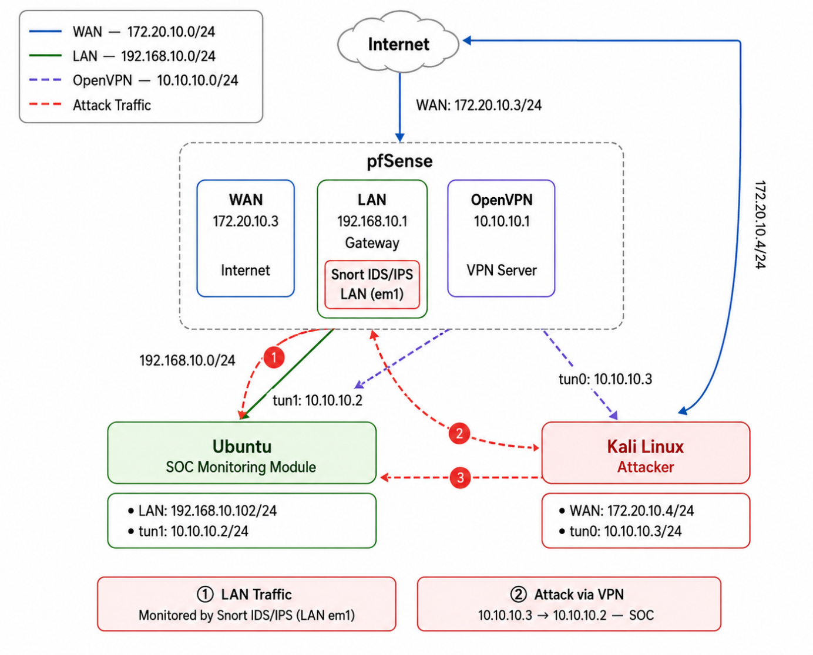

# Multi-Layer Secure Network Lab

This repository packages a graduation project built around a Defense-in-Depth virtual network. The lab combines `pfSense`, `OpenVPN`, `Snort IDS/IPS`, Ubuntu hardening, Python automation, and a Dockerized monitoring stack with `syslog-ng`, `Promtail`, `Loki`, and `Grafana`.

The repository is written to match the thesis topology and the real lab layout, so the default IP values, diagrams, and automation scripts stay aligned.

## Architecture

- WAN network: `172.20.10.0/24`
- LAN network: `192.168.10.0/24`
- OpenVPN network: `10.10.10.0/24`

Core nodes:

- `pfSense`: `192.168.10.1`
- `Ubuntu Server`: `192.168.10.101`
- `VPN client`: `192.168.10.102`
- `Kali attacker`: `192.168.10.150`

## What The Project Demonstrates

- Network segmentation and firewall policy on `pfSense`
- Remote access using `OpenVPN`
- Detection and prevention with `Snort IDS/IPS`
- Ubuntu host hardening with `UFW`, `fail2ban`, and `auditd`
- SOC-style log collection and response with Python automation
- Dashboarding with `Loki` and `Grafana`
- Attack validation for scanning, brute force, and light flood testing

## Diagrams

### Network topology


### Lab deployment



## Demo Video

A short demo video is included for portfolio presentation:

- [`docs/videos/demo-overview.mp4`](docs/videos/demo-overview.mp4)

## Repository Contents

- `automation/ansible/` - inventory, group variables, and playbooks
- `automation/scripts/` - Python and shell automation
- `automation/monitoring/` - Docker Compose stack for logging and dashboards
- `docs/images/` - diagrams extracted from the report
- `docs/videos/` - short demo video for CV or portfolio use

## Prerequisites

Use three machines or VMs when reproducing the lab:

- Control machine or Kali host for `Ansible`, Python scripts, and validation commands
- Ubuntu server for the monitoring stack and the protected internal host
- pfSense for firewall, VPN, and Snort

Required tools on the control machine:

- `ansible`
- `python3`
- `pip`
- `sshpass`
- `paramiko` and the packages listed in `automation/scripts/requirements.txt`

## Deployment Steps

1. Copy [`automation/.env.example`](automation/.env.example) to `automation/.env`.
2. Fill the values to match your lab IPs, credentials, and pfSense aliases.
3. Install dependencies on the control machine:

```bash
sudo apt install ansible python3-pip sshpass -y
pip3 install -r automation/scripts/requirements.txt
```

4. Run the Ansible playbooks from `automation/` on the control machine:

```bash
cd automation
ansible-playbook -i ansible/inventory.ini ansible/playbooks/site.yml
```

5. Start the monitoring stack on the Ubuntu monitoring host:

```bash
cd automation/monitoring
docker compose up -d
```

6. Run validation scripts from the control machine or Kali host:

```bash
cd automation/scripts
python3 test_all_layers.py
python3 attack_simulation.py
python3 auto_response.py
```

## Verification

After deployment, verify these items:

- `pfSense` WebGUI is reachable on `https://192.168.10.1`
- `OpenVPN` tunnel uses the `10.10.10.0/24` network
- `Snort` alerts appear in the pfSense interface
- `Grafana` opens the expected dashboard
- `Loki` receives firewall or Snort-related logs
- `auto_response.py` can read logs and record incidents

Recommended checks:

- `automation/scripts/test_all_layers.py` for a quick pass/fail summary
- pfSense `Services > Snort > Alerts`
- Grafana dashboard for log visibility
- Ubuntu service status for `docker`, `fail2ban`, `ufw`, `apache2`, and `auditd`

## Expected Output

Typical healthy results look like this:

- `test_all_layers.py` shows most or all checks passing
- `attack_simulation.py` produces Snort alerts for scans or flood tests
- `auto_response.py` logs incidents and can add source IPs to the pfSense block table
- Grafana shows firewall and security events from the lab

## Troubleshooting

- If the VPN test fails, confirm `VPN_GW=10.10.10.1` and that the OpenVPN tunnel is up.
- If Snort logs are missing, locate the real alert file on pfSense with:

```bash
find /var/log/snort -type f -name alert
```

- If IP blocking does not work, confirm the pfSense table name in `.env` matches the alias on the firewall, for example `Blocked_IPs`.
- If Grafana is empty, check that `syslog-ng`, `Promtail`, and `Loki` are all running and that their volume paths match the Ubuntu host.
- If Ansible cannot connect, verify the inventory IPs and SSH credentials in `automation/.env`.

## Practical Notes

- The repository is meant to be a thesis-aligned lab implementation, not a production deployment.
- The default values are chosen to stay consistent across the thesis, diagrams, and scripts.
- You can adapt the IPs and credentials in `.env` without editing the scripts directly.
