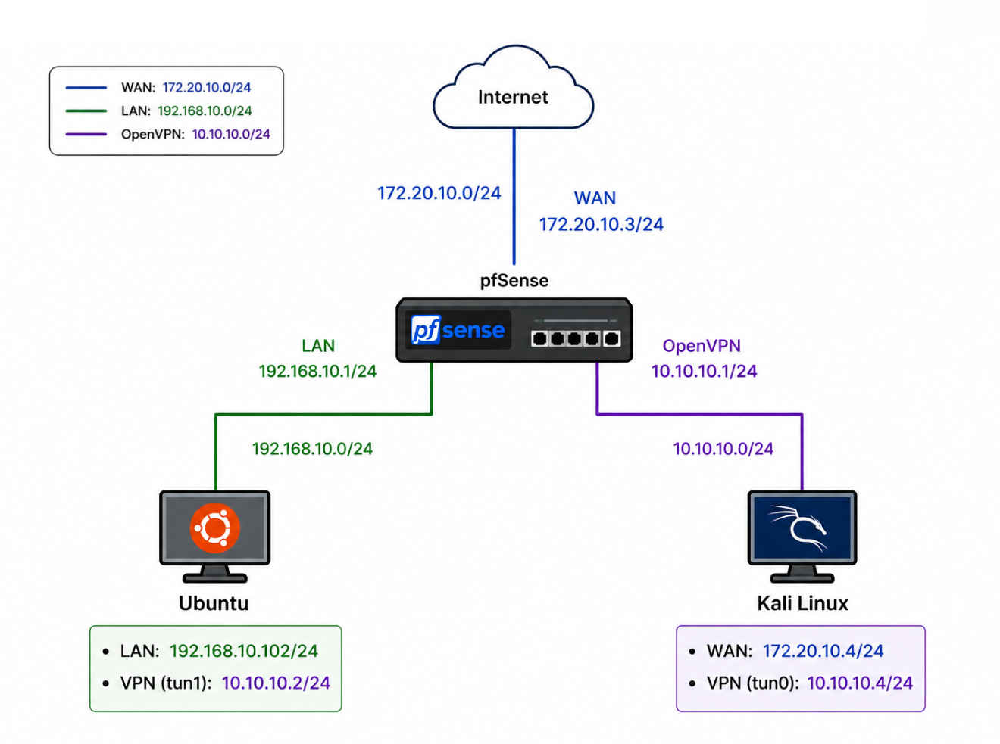

# Research and Development of a Multi-Layer Secure Network Architecture

This repository documents and packages the graduation project on a Defense-in-Depth network security model built around `pfSense`, `OpenVPN`, `Snort IDS/IPS`, Ubuntu hardening, automation, and monitoring.

The project follows the thesis structure and the lab topology shown in the report, while the scripts in this repository are parameterized so they can be adapted to the exact IP plan of your virtual lab.

## Thesis Architecture

The report describes a layered architecture with these core zones:

- `WAN` network: `172.20.10.0/24`
- `LAN` network: `192.168.10.0/24`
- `OpenVPN` network: `10.10.10.0/24`

Core nodes:

- `pfSense` at `192.168.10.1` on the LAN side, with WAN and OpenVPN interfaces
- `Ubuntu Server` at `192.168.10.102`, acting as the protected internal host and monitoring host
- `Kali Linux` as the attacker/test machine
- `VPN client` machine used for remote-access validation

## Network Diagrams

### Overall topology



### Experimental deployment


## What The Project Demonstrates

- Firewall access control and network segmentation with `pfSense`
- Secure remote access with `OpenVPN`
- Network attack detection and prevention with `Snort IDS/IPS`
- Host hardening on Ubuntu using `UFW`, `fail2ban`, and `auditd`
- Security monitoring and incident response using Python-based automation
- Log collection and dashboarding with `syslog-ng`, `Promtail`, `Loki`, and `Grafana`
- Attack simulation scenarios for validation:
  - ICMP ping and host discovery
  - Nmap reconnaissance and port scanning
  - SSH and FTP authentication attempts
  - Brute-force and light DoS-style testing

## Thesis Scenarios

The report evaluates the architecture through these scenarios:

1. Internal network access control
2. Remote access via OpenVPN
3. Detection of network reconnaissance and scanning
4. Detection of unauthorized authentication attempts
5. SOC monitoring and incident response

The report also includes:

- OpenVPN certificate creation and client export
- Snort interface configuration and rule selection
- A SOC monitoring module that analyzes traffic/logs, produces alerts, and supports response actions
- Telegram bot-driven alerting and IP blocking in the written thesis

## Repository Contents

- `automation/ansible/` - inventory, group variables, and playbooks
- `automation/scripts/` - Python and shell automation
- `automation/monitoring/` - monitoring stack and log pipeline
- `docs/images/` - diagrams extracted from the report
- `Firewall_fw-edge-01/`, `UbuntuSV_srv-lan-01/`, `Ubuntu_vpn-client-01/`, `Kali/` - local VM artifacts and notes

## How To Run

1. Copy [`automation/.env.example`](automation/.env.example) to `.env`.
2. Set the values to match your lab.
3. Install dependencies on the control machine:

```bash
sudo apt install ansible python3-pip sshpass -y
pip3 install -r automation/scripts/requirements.txt
```

4. Run the Ansible playbooks and scripts from `automation/`.
5. Start the monitoring stack on the Ubuntu server with Docker Compose.

## Environment Variables

Common variables used by the scripts:

- `PFSENSE_HOST`
- `PFSENSE_USER`
- `PFSENSE_PASS`
- `PFSENSE_URL`
- `PFSENSE_FW_LOG`
- `PFSENSE_SNORT_LOG`
- `PFSENSE_BLOCK_TABLE`
- `UBUNTU_HOST`
- `UBUNTU_USER`
- `UBUNTU_PASS`
- `VPN_GW`
- `TARGET_FW`
- `TARGET_SV`
- `TARGET_SSH_USER`
- `LAB_SUBNET`
- `LAN_NETWORK`
- `LAN_GATEWAY`
- `VPN_NETWORK`
- `VPN_PORT`
- `SNORT_TABLE`
- `INCIDENTS_LOG`

See [`automation/.env.example`](automation/.env.example) for a sample.

## Practical Notes

- The Snort layer is already represented in the lab and in the report.
- The automation and monitoring pieces in this repository are organized to support the thesis workflow, but they still depend on the lab environment being configured correctly.
- If your lab uses different IPs or credentials, update `.env` rather than editing the scripts directly.

## Report Traceability

The network diagrams in `docs/images/` were extracted directly from the report so the GitHub repository stays aligned with the thesis.
